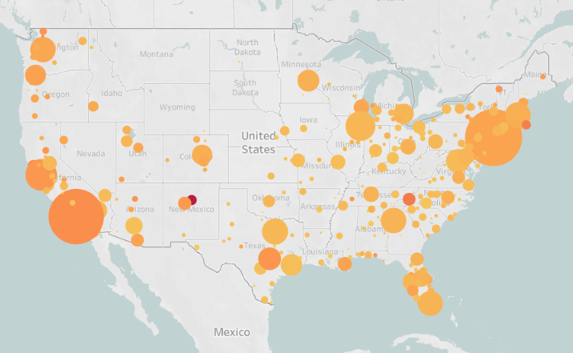

## Where Do Artists Live?
**Exploring the geography of artistic occupations using ACS microdata and Tableau**

---

### Overview
This project uses 2022 American Community Survey (ACS) microdata (via IPUMS) to visualize where artists and other creative workers live across U.S. metropolitan areas.

The analysis examines both:
- **Total counts** of arts occupations per metro area, and  
- **Relative concentrations (Location Quotients)** — identifying places with unusually high shares of artists relative to their total workforce.

The resulting Tableau dashboard enables users to explore artist location patterns by discipline and metro area.

**View the dashboard on Tableau Public:**  
[Where Do Artists Live?](https://public.tableau.com/app/profile/samuel.shaw2748/viz/WheredoArtistsLive/WheredoArtistsLive)

---

### Data & Methods
- **Source:** 2022 ACS 5-year Public Use Microdata Sample (PUMS), approximately 17 million cases.  
- **Platform:** Data cleaning and aggregation in R; visualization in Tableau.  
- **Key Variables:**  
  - `OCC` (Occupation)  
  - `MET2013` (Metro Area)  
  - `PERWT` (Person Weight)  

**Process Summary:**
1. Imported raw ACS PUMS data (`read.csv()`).
2. Merged occupation and metro labels from IPUMS codebooks.
3. Subset for arts-related occupations (e.g., 2600: Artists, 2752: Musicians, 2910: Photographers).
4. Aggregated total weighted counts by metro area.
5. Calculated *Location Quotients (LQ)* to standardize metro-level comparisons.
6. Exported final dataset for Tableau visualization.

---

### Visualization
The Tableau dashboard includes interactive filters to:
- Select an **artistic discipline** (e.g., Writers, Musicians, Designers)
- Toggle between **absolute** and **relative** metro distributions

A screenshot preview:

---

### Reflections
This was my first large-scale ACS data project — an early exploration of data cleaning, aggregation, and visualization at scale. Future updates may include:
- Trend analysis across multiple ACS waves
- Integration with pandemic-era data
- Extended occupational typologies beyond the arts
